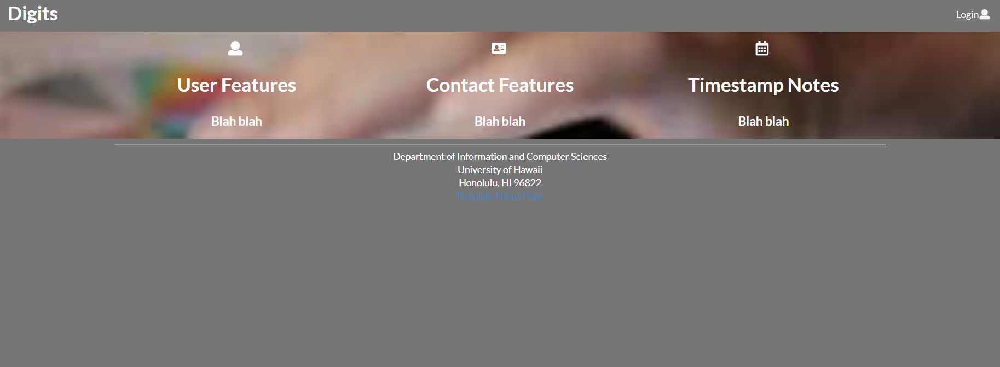
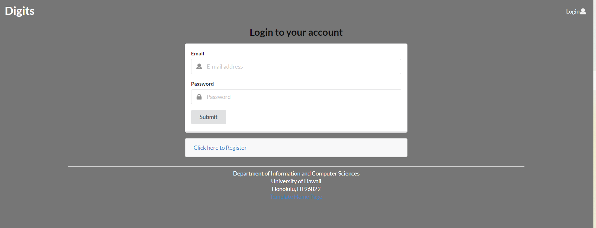
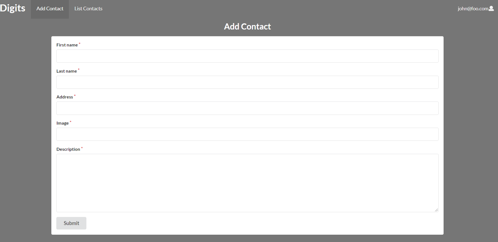
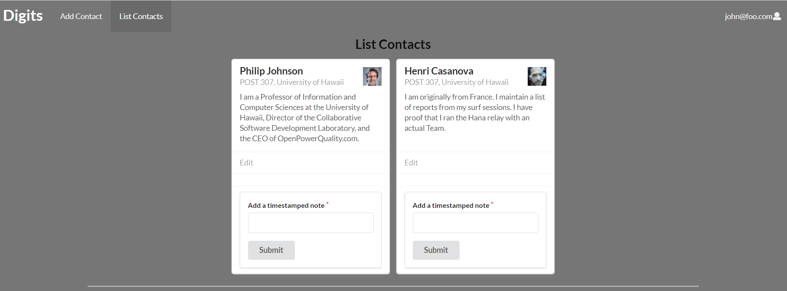
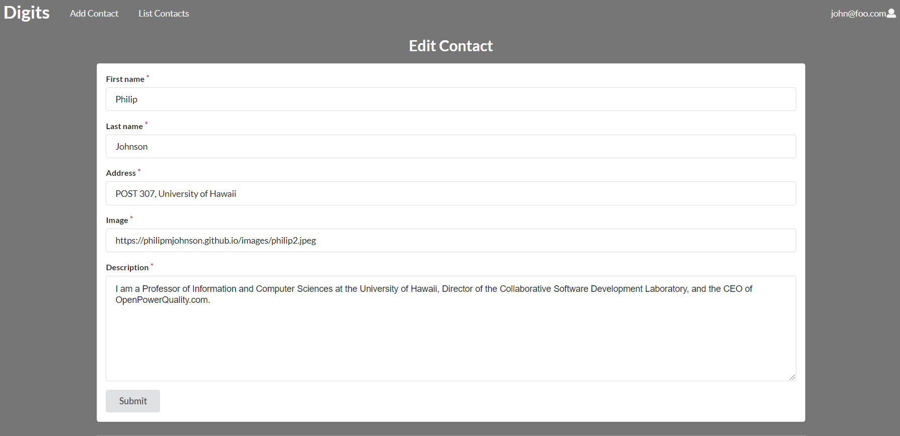

## Digits has the following features
  * Register accounts
  * Create and edit contacts
  * Set notes to your contacts with timestamps

## Installation
First, [install Meteor](https://www.meteor.com/install).

Second, get a copy of the digits repository in github.

Third, cd into the app directory and install the required libraries with
 
```
$ meteor npm install
```

Fourth, run the system with 

```
$ meteor npm run start
```

The app should appear in http://localhost:3000

## Pages

### Landing Page
The Landing page describes the features of the application and links to the sign in page


### Sign In Page
The Sign in Page allows for users to sign in



### Add Contact Page
The Add contacts allows users to add contacts to their list of contacts which are displayed in the List Contact Page



### List Contacts Page
The List Contacts Page lists all the added contacts and already added contacts that the user has. Also the user can add timestamped notes to each contact card.



### Edit Contact Page
The Edit Contact Page allows the user to edit the information of their contacts


